# Installing and setting up DigiByte Core in Windows

- [Installing DigiByte Core](#installing-digibyte-core)
- [Running a DigiByte node](#running-a-digibyte-node)
- [Issue with high CPU usage](#issue-with-high-cpu-usage)

## Installing DigiByte Core

By itself ~4.5 GB of RAM is used by DigiByte Core. At least 6 GB or more RAM for your PC is recommended.
Download the latest ...-win64-setup executable from the [DigiByte Core releases page](https://github.com/DigiByte-Core/digibyte/releases) and execute it. An installation wizard will open.

Follow the instructions and click **Next >**.

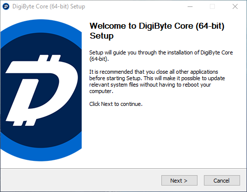

Choose a Destination Folder where DigiByte Core will be installed. By default this is **C:\Program Files\DigiByte**. Click **Next >**.

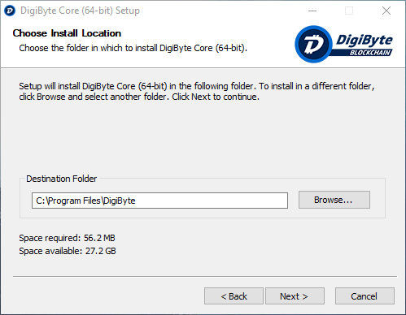

Choose a Start Menu Folder for the DigiByte Core shortcut. By default this will be called **DigiByte Core**. Click **Install**.

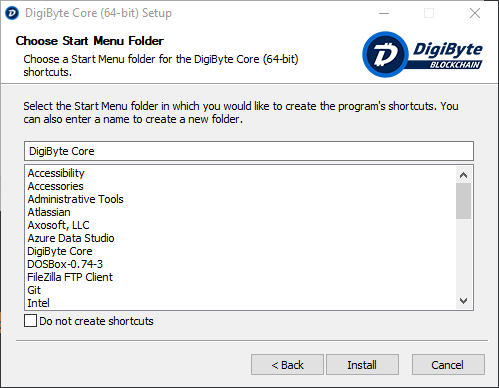

The installation wizard will now install all the necessary files. Once this is done click **Next >**.

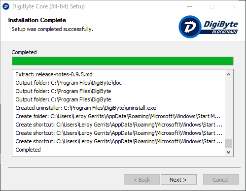

The installation is now complete, leave **Run DigiByte Core (64-bit)** checked and click **Finish**. DigiByte Core will now start.

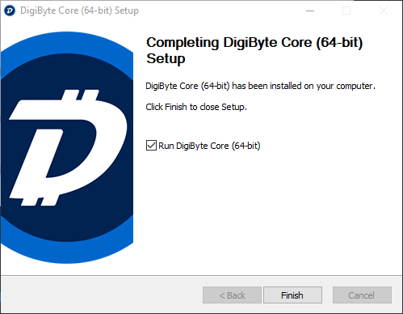

DigiByte Core is slow on startup, especially if you're starting it for the first time and the entire chain of blocks needs to be downloaded.

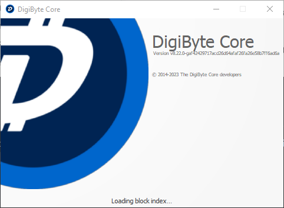

After a while, the app will open and progress on the sync process will become visible:

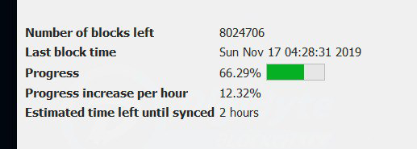

## Running a DigiByte node

In order for your DigiByte Core installation to function as a node, some additional steps are necessary. Specifically port 12024 needs to be opened in order to allow other clients to communicate with your node.

Press Windows + R to launch run, type **firewall.cpl** and click **OK**:

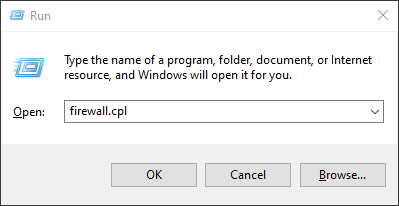

In the **Windows Defender Firewall** window, click **Advanced settings** on the left:

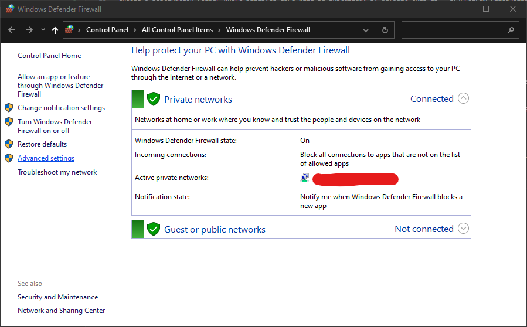

In the **Windows Defender Firewall with Advanced Security** window, click **Inbound Rules** in the left navigation pane, then click **New Rule** in the right navigation pane (Actions):

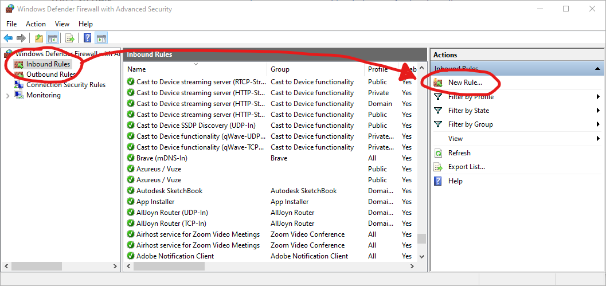

In the **New Inbound Rule Wizard** window, step **Rule Type**, select **Port** and click **Next >**:

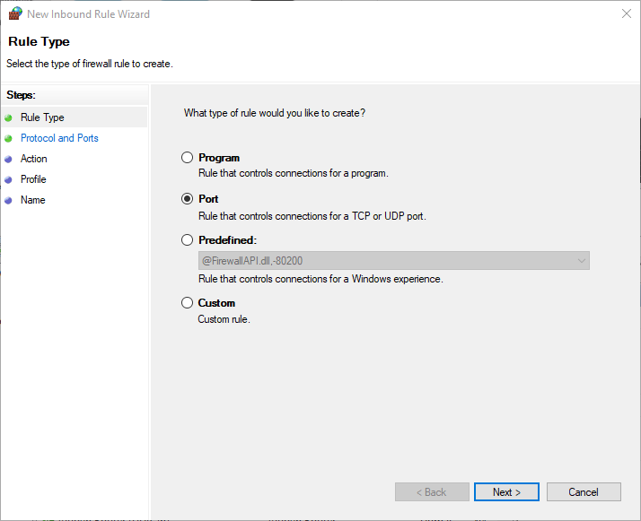

In the **New Inbound Rule Wizard** window, step **Protocol and Ports**, select **TCP**, select **Specify local ports**, fill in **12024** and click **Next >**:

In the **New Inbound Rule Wizard** window, step **Action**, select **Allow the connection** and click **Next >**:

In the **New Inbound Rule Wizard** window, step **Profile**, check all 3 checkboxes and click **Next >**:

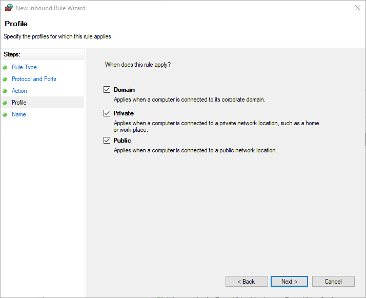

In the **New Inbound Rule Wizard** window, step **Name**, give this rule a custom name. Give it a name that is easily identified for this purpose, such as **DigiByte Core Node (incoming port 12024)** Click **Finish**:

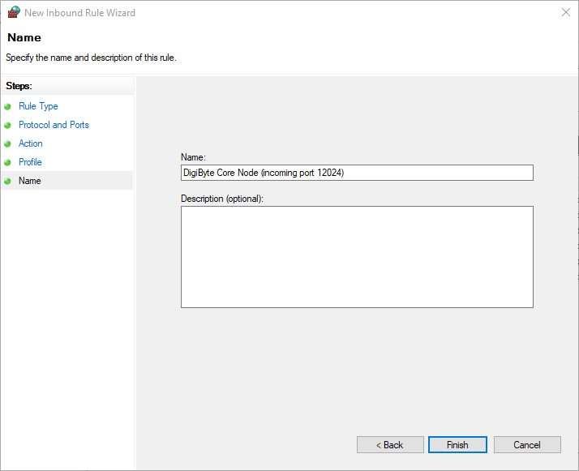

Back in the **Windows Defender Firewall with Advanced Security** window, double click the rule you just added:

In the **DigiByte Core Node (incoming port 12024) Properties** window, go to tab **Programs and Services**, select **This program:** and click **Browse...**:

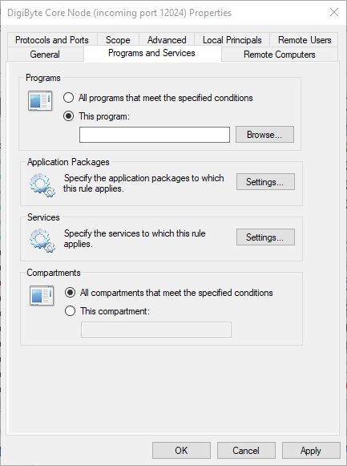

Locate **digibyte-qt.exe**, this executable is in the install directory you chose to install DigiByte Core in an earlier step. By default this is **C:\Program Files\DigiByte**. Back in the **DigiByte Core Node (incoming port 12024) Properties** window after selecting the file, click **OK**:

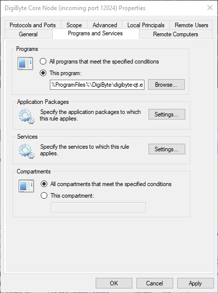

You have now made an **inbound** rule. The exact same steps need to be taken for an **outbound** rule. Back in the **Windows Defender Firewall with Advanced Security** window, click **Outbound Rules** in the left navigation pane, then click **New Rule** in the right navigation pane (Actions):

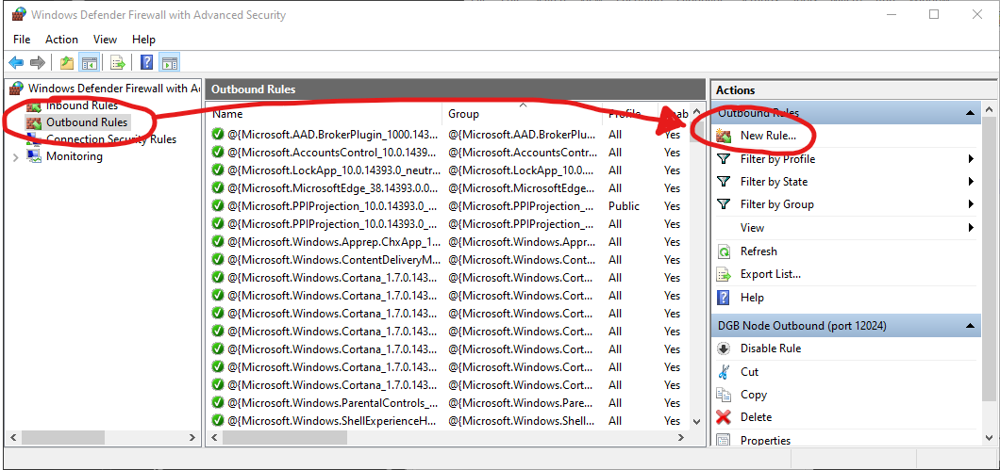

The rest of the steps are exactly the same as when you would add an **inbound** rule. 

Open DigiByte Core and check the node icon in the bottom right of the screen. All 4 nodes should now be colored:

You can also click the icon and click **Show Peers tab** in the context menu:

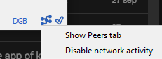

In the **Node window** window, go to tab **Information** and check if **Number of connections** has both incoming and outgoing connections:

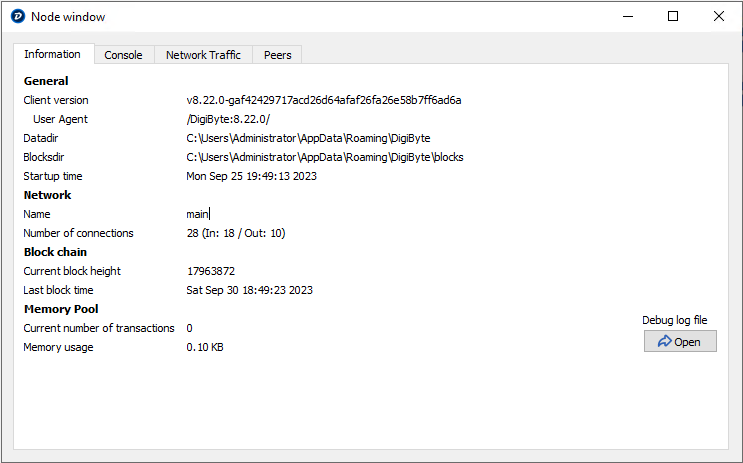

If the amount of incoming connections remains 0, that means your node still isn't completely accessible and you likely need to apply port forwarding in your router. Refer to your ISP or router manufacturer's manual to do this as this varies per router model/manufacturer.

## Issue with high CPU usage

Typically DigiByte Core consumes ~4.5 GB of RAM on Windows, but CPU usage should remain lower than 1%. If DigiByte Core is consuming large amounts of CPU capacity (10% - 30%), it's likely that Windows' built-in firewall and antivirus may be interfering. Adding an exclusion to **digibyte-qt.exe** will most likely solve this.

Open the **Windows Security** app. You can find it by opening the start menu and typing **Security**:

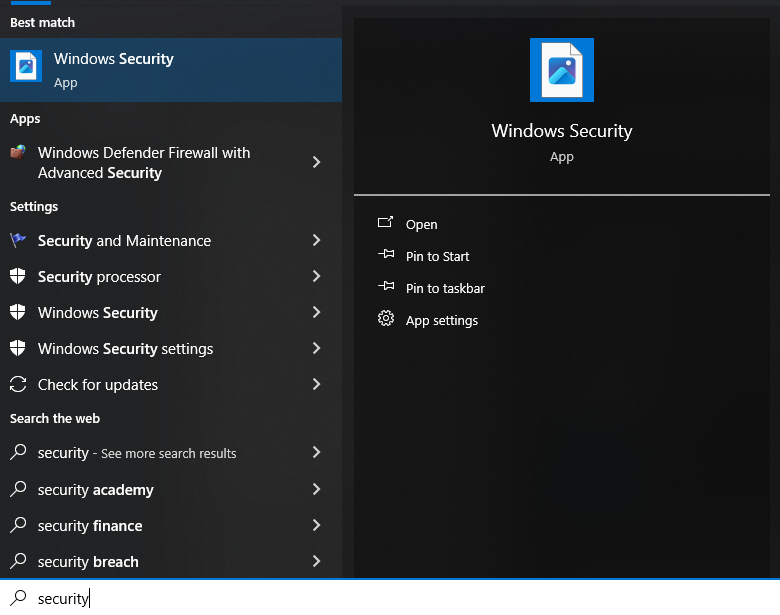

In the **Windows Security** window, click **Virus & threat protection** in the left navigation pane, locate **Virus & threat protection settings** in the middle pane and click **Manage settings** below it:

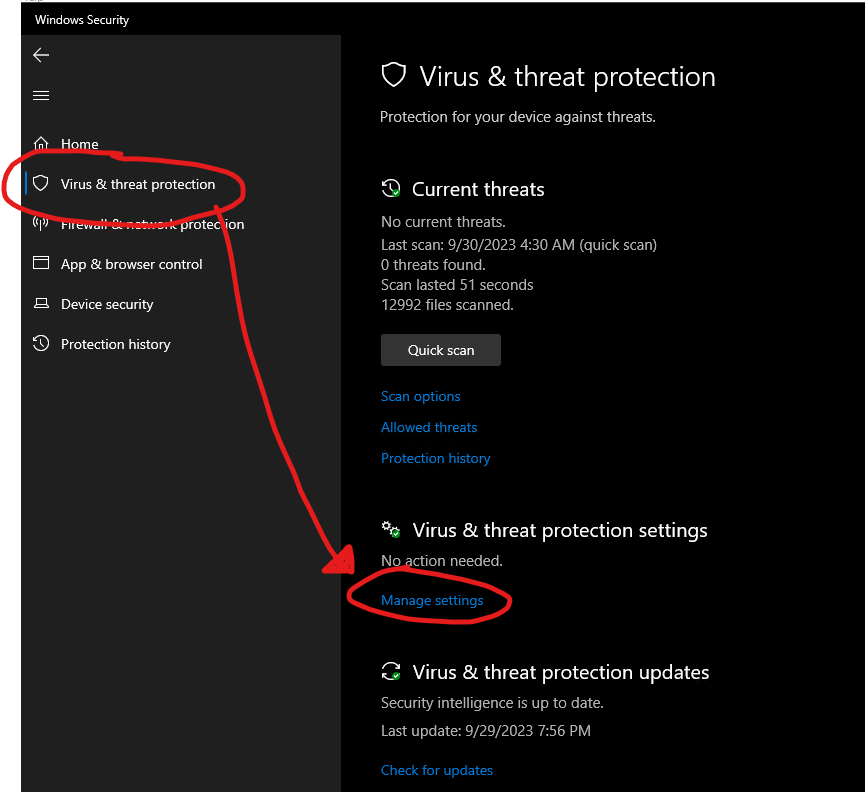

Scroll down in the middle pane, locate **Exclusions** and click **Add or remove exclusions** below it:

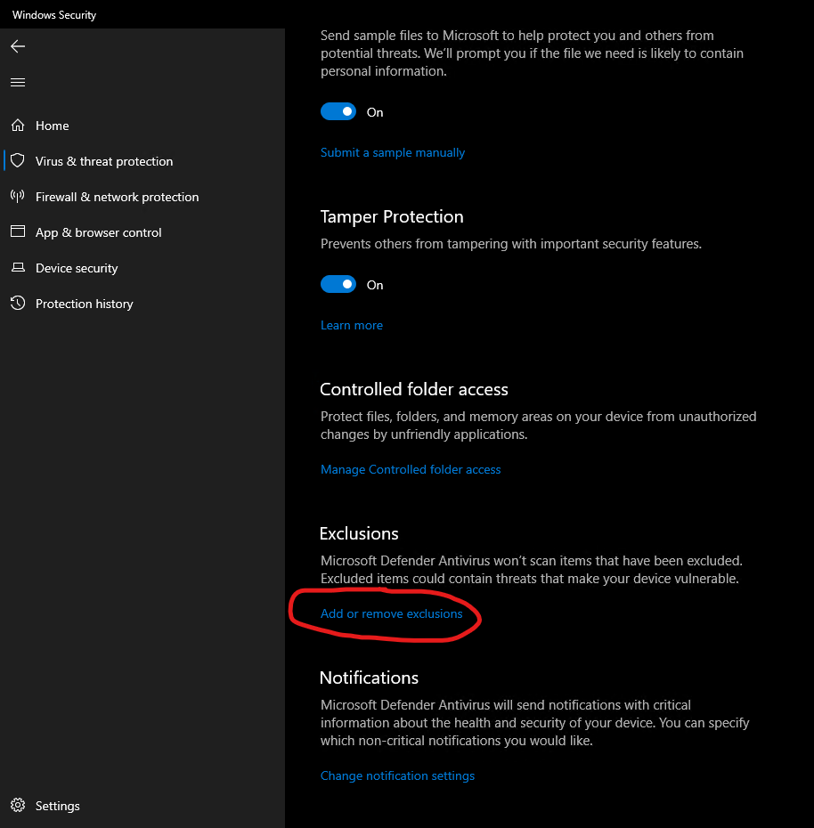

Click **+ Add an exclusion** and select **File** in the context menu that appears:

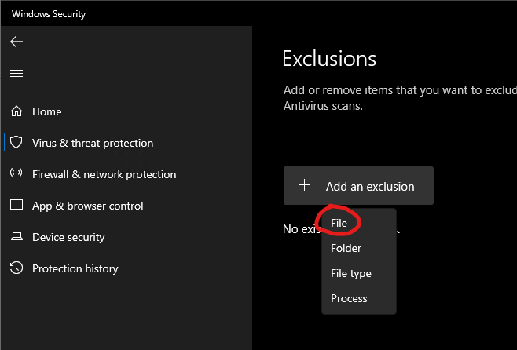

Locate **digibyte-qt.exe**, this executable is in the install directory you chose to install DigiByte Core in an earlier step. By default this is **C:\Program Files\DigiByte**. Back in the **Windows Security** window, the file should now be shown:

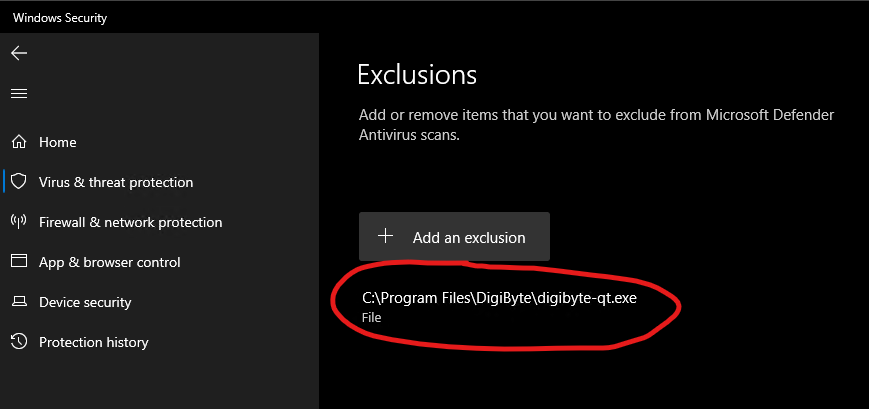
